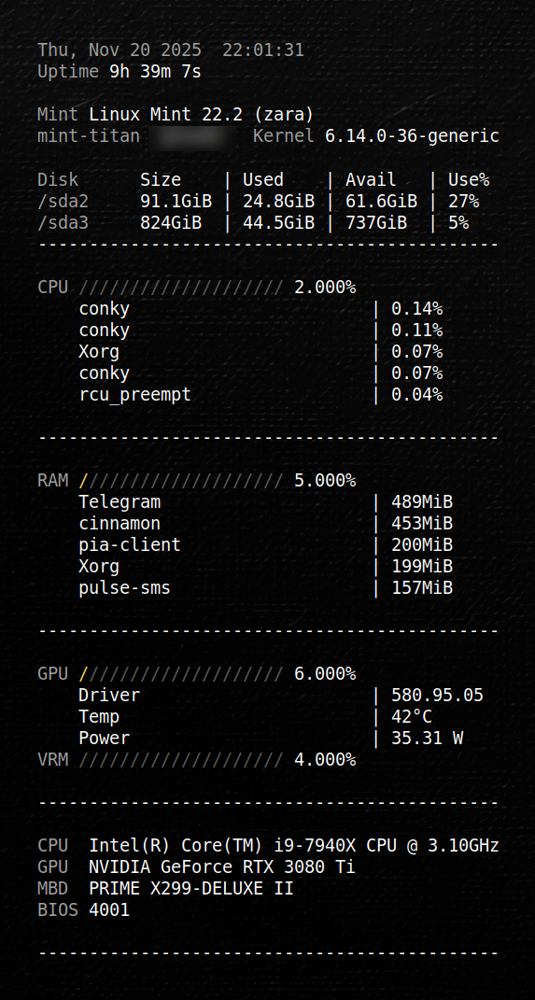
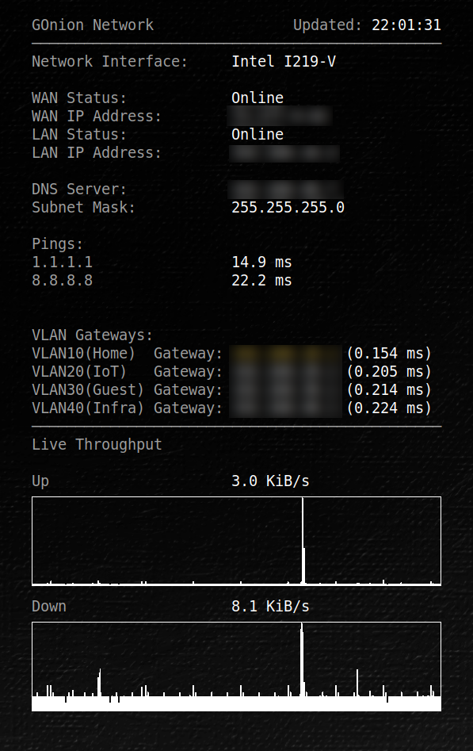
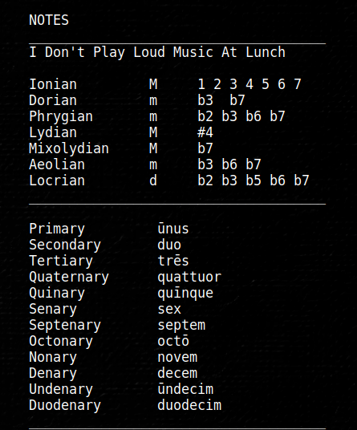
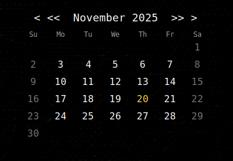

# gtex62-clean-suite

[](LICENSE)
[](https://github.com/GTex62/gtex62-clean-suite/stargazers)
[](https://github.com/GTex62/gtex62-clean-suite/issues)
[](https://github.com/GTex62/gtex62-clean-suite/commits/main)


A modular, minimalist Conky desktop suite for Linux Mint (and other
distros), inspired by several Rainmeter skins and rebuilt for Conky
using Lua, custom widgets, themed slash bars, GPU/VRAM bars, weather
arc, calendar, notes, and more.

This is a complete desktop system monitor and information panel set
while keeping everything text-first, elegant, and unobtrusive.

## Screenshots

### Full Suite


### Weather + Horizon Arc


### System Info


### Network Info


### Notes Widget


### Calendar Widget



## Wallpapers

This Conky suite includes original wallpapers created by **Geoffrey Greene**.  
They are optional, but recommended to match the aesthetic shown in screenshots.
7680x2170

Files:

- `wallpapers/painted-canvas-bw-01.png` – Black & White
- `wallpapers/painted-canvas-db-01.png` – Dark Blue
- `wallpapers/painted-canvas-g-01.png`  – Green

These wallpapers are licensed for **personal, non-commercial use**.


## Features

### System Information (sys-info.conky.conf)

-   CPU usage, load, and temperatures\
-   RAM usage\
-   Disk usage per mount\
-   OS, kernel, uptime, hostname\
-   System firmware info\
-   Logging of network interfaces\
-   Live throughput graph\
-   Fully configurable via `theme.lua`

### GPU Widget

-   GPU usage slash bar\
-   VRAM usage slash bar\
-   Temperature\
-   Fan percentage\
-   Power draw (W)\
-   Driver version\
-   Automatic detection for NVIDIA (via `nvidia-smi`)

### Weather Widget

-   Weather arc inspired by ASTROweather\
-   Current METAR, TAF, AIRMET/SIGMET + OWM blended\
-   5-day forecast\
-   Sunrise/sunset\
-   Wind, humidity, pressure\
-   Icons + text\
-   Everything styled through Lua

### Calendar Widget

-   Month calendar with current day highlight\
-   Clean typography\
-   Minimalist layout

### Notes Widget

-   Simple and elegant notes panel\
-   Readable right-hand column\
-   Monospaced or themed fonts

### Shared Theme System

The `theme.lua` file controls: - Font family\
- Font size\
- Colors\
- Slash bar width & style\
- Column positions\
- Spacing and separators
- Optional per-widget tweaks
---

## Folder Structure

Installed under your home config:

```text
~/.config/conky/gtex62-clean-suite/
├── theme.lua
├── widgets/
│   ├── sys-info.conky.conf
│   ├── weather.conky.conf
│   ├── calendar.conky.conf
│   ├── date-time.conky.conf
│   ├── notes.conky.conf
│   ├── net-sys.conky.conf
│   ├── owm.env              # your OpenWeather API key (user-provided; not in git)
│   └── owm.vars             # your OWM config/paths (user-provided; not in git)
├── lua/                     # shared Lua modules for all widgets
├── scripts/                 # helper scripts (e.g., owm_fetch.sh, wan_ip.sh, start-conky.sh)
├── icons/
├── wallpapers/
├── screenshots/
├── LICENSE
└── README.md
```

---

## Requirements

- Conky (with Lua support) — e.g. `conky-all` on Debian/Ubuntu/Mint  
- `curl`  
- `jq`  
- `lm-sensors` (for temperatures)  
- For GPU widget:
  - NVIDIA GPU
  - Working `nvidia-smi` command

---

## Installation

### 1. Install Conky + dependencies

``` bash
sudo apt install conky-all curl jq lm-sensors
sudo sensors-detect
```

### 2. Clone this repo

``` bash
mkdir -p ~/.config/conky
cd ~/.config/conky
git clone https://github.com/GTex62/gtex62-clean-suite.git
```

---

### 3. Configure OpenWeather variables

There are two files involved:

- `owm.env` — holds your OpenWeather API key (and optionally some settings)
- `owm.vars` — holds cache paths and other variables for the forecast logic

Start from the provided examples:

```bash
cd ~/.config/conky/gtex62-clean-suite/widgets/
cp owm.env.example  owm.env
cp owm.vars.example owm.vars
```

Then edit them:

```bash
xed owm.env
xed owm.vars
```

In `owm.env`:

- Replace `YOUR_OPENWEATHER_API_KEY_HERE` with your actual API key.  
  (Do **not** commit the real key to Git.)

In `owm.vars`:

- Change `YOURUSERNAME` in  
  `OWM_DAILY_CACHE=/home/YOURUSERNAME/.cache/conky/owm_forecast.json`  
  to your actual Linux username (or full path).  
- Optionally adjust LAT/LON/UNITS/LANG to match your location.

---

### 4. Start widgets

The suite includes a helper script to start all widgets at once:
```bash
~/.config/conky/gtex62-clean-suite/scripts/start-conky.sh &
```

You can also start individual widgets manually if you prefer:
``` bash
conky -c ~/.config/conky/gtex62-clean-suite/widgets/sys-info.conky.conf &
conky -c ~/.config/conky/gtex62-clean-suite/widgets/weather.conky.conf &
conky -c ~/.config/conky/gtex62-clean-suite/widgets/calendar.conky.conf &
conky -c ~/.config/conky/gtex62-clean-suite/widgets/date-time.conky.conf &
conky -c ~/.config/conky/gtex62-clean-suite/widgets/notes.conky.conf &
```
Add the script to your desktop environment’s startup applications to launch the suite automatically on login.

---

### Screen alignment and positioning

Each `.conky.conf` file has its own `alignment`, `gap_x`, and `gap_y` settings tuned for a dual-monitor setup on the original system (right-side secondary display).

If widgets appear off-screen or stacked incorrectly:

1. Open the `.conky.conf` file for the widget you want to move.  
2. Look for these lines near the top:
   ```lua
   alignment = 'top_right',
   gap_x = 2780,
   gap_y = 50,
   ```
3. Adjust `alignment` (`top_left`, `top_right`, `bottom_left`, `bottom_right`, etc.) and `gap_x` / `gap_y` until the widget sits where you want it.  
4. Save and reload that widget:
   ```bash
   pkill conky
   ~/.config/conky/gtex62-clean-suite/scripts/start-conky.sh &
   ```

Tip: You can experiment interactively by changing the numbers in small steps (e.g., ±50 px).

---

## Customization

Most of the visual behavior is controlled from:

```text
~/.config/conky/gtex62-clean-suite/theme.lua
```

Things you can change there:

- Fonts (family, size)
- Colors (main text, accents)
- Slash bar style and width
- Column positions (for labels and values)
- Spacing for separators and sections
- Calendar spacing and padding
- Weather arc and planet styling options (if you enable planets)

Each `.conky.conf` file uses the same shared theme, so adjusting `theme.lua` lets you redesign the look of the entire suite without editing each widget individually.

---

## Credits & Inspirations

### Plainext (Rainmeter → Conky)

https://github.com/EnhancedJax/Plainext

### DesktopWidgets -- Network Info (Rainmeter)

https://www.deviantart.com/g3xter/art/DesktopWidgets-Network-Info-713140520

### ASTROweather (Rainmeter)

https://www.deviantart.com/xenium/art/ASTROWeather-Weather-Skin-776886670

### Amnio/Notes (Rainmeter)

https://github.com/JosephB2000/Amnio

## License

This project is licensed under the **MIT License**.

